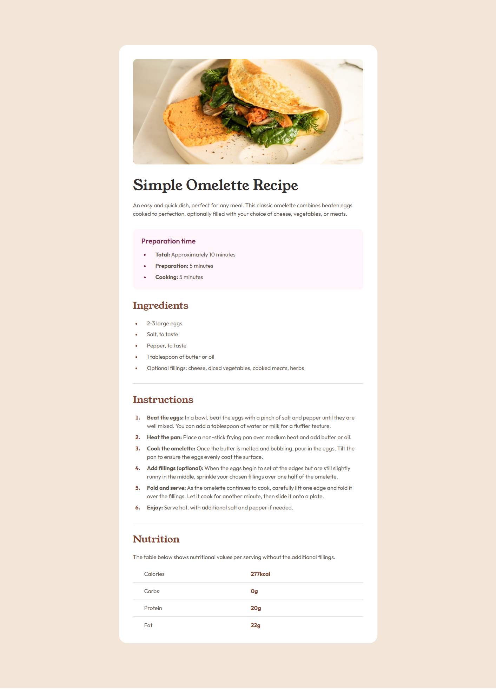
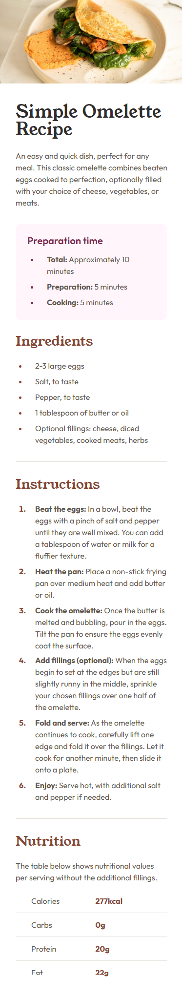

# Frontend Mentor - Recipe page solution

This is a solution to the [Recipe page challenge on Frontend Mentor](https://www.frontendmentor.io/challenges/recipe-page-KiTsR8QQKm).

## Table of contents

- [Overview](#overview)
  - [The challenge](#the-challenge)
  - [Screenshot](#screenshot)
  - [Links](#links)
- [My process](#my-process)
  - [Built with](#built-with)
  - [What I learned](#what-i-learned)
  - [Continued development](#continued-development)
  - [Useful resources](#useful-resources)
- [Author](#author)
- [Acknowledgments](#acknowledgments)

**Note: Delete this note and update the table of contents based on what sections you keep.**

## Overview

### Screenshot

### Links

- Solution URL: [https://github.com/FilipKod/recipe-page](https://github.com/FilipKod/recipe-page)
- Live Site URL: [https://recipe-page-filipkod.netlify.app/](https://recipe-page-filipkod.netlify.app/)

## My process

### Built with

- Semantic HTML5 markup
- CSS custom properties
- CSS Grid
- Mobile-first workflow

## Author

- LinkedIn - [Filip Madunicky](https://www.linkedin.com/in/madunickyfilip/)
- Frontend Mentor - [@FilipKod](https://www.frontendmentor.io/profile/FilipKod)
- Github - [FilipKod](https://github.com/FilipKod)
